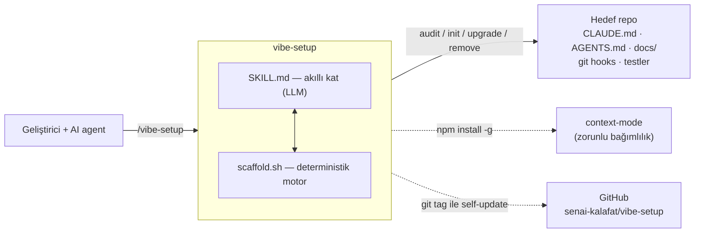

# vibe-setup

Herhangi bir repoyu **AI/agent destekli geliştirme ("vibe coding")** için denetler ve eksikleri kurar —
**stack- ve dil-bağımsız**. Claude Code skill'i + deterministik scaffold script'i.

Ne kurar: `CLAUDE.md`, `AGENTS.md`, `docs/` + ADR, test harness, herkesi bağlayan git
pre-commit hook (fmt/lint/doc-sync), `.claude/settings.json` izinleri, commit/PR(MR) şablonları, opsiyonel
Cursor/Gemini CLI/Aider kuralları, (ops) `llms.txt` ve tekrar kullanılabilir vibe checklist. context-mode'u
(Claude/Cursor/Antigravity) zorunlu bağımlılık olarak kurar. Önce/sonra uyumluluk skoru gösterir. Kaldırmak
istersen `remove` komutu (dry-run varsayılan) var.

Desteklenen: Go, Node/TS, Python, Java, Kotlin, Swift, Rust, Ruby, .NET, PHP, Elixir + boş repo.

## Mimari (özet)

Geliştirici (ya da bir AI agent) skill'i çağırır; **akıllı kat** repoyu okuyup içerik üretir, **deterministik
motor** iskeleti/hook'ları düşürür ve sürüm driftini yönetir. Ürettiği her şey hedef reponun içine yazılır.



Detaylı diagramlar ve akış: [docs/architecture/overview.md](docs/architecture/overview.md).

## Nasıl çalışır

İş **iki kata** ayrılır — bu projenin merkezî tasarımı:

- **Deterministik motor** — [scaffold.sh](skills/vibe-setup/scaffold.sh): saf bash, tek opsiyonel
  dep `jq` (yoksa audit yalnız izin satırlarını atlar). Stack tespiti, agnostik iskelet, komut
  substitüsyonu, sürümlü drift tespiti. Sekiz komut:
  - `audit` — hazırlık tablosu (✅/❌/—) + makine-okur `SCORE=N/M` footer
  - `init` — eksik agnostik dosyaları düşürür; **var olanı asla ezmez** (SKIP, idempotent); legacy tekil
    `AGENT.md` varsa `AGENTS.md`'ye migrate eder (mv + geriye-uyumlu symlink)
  - `init-cursor` — Cursor kural dosyaları (`.cursor/rules/project.mdc` + `.cursorrules` → CLAUDE.md)
  - `init-gemini` — Gemini CLI context dosyası (`GEMINI.md` → `@CLAUDE.md` importu)
  - `init-aider` — Aider config dosyası (`.aider.conf.yml` → `read: AGENTS.md`)
  - `upgrade` — zaten kurulu repoyu yeni sürüme taşır (sha-drift → UPDATE/ADD/CONFLICT; asla ezmez)
  - `remove` — vibe-setup'ın yarattığı, hâlâ değişmemiş dosyaları kaldırır (dry-run varsayılan, `--apply` gerçek siler)
  - `profile` — tespit edilen stack profilini basar (9 alan + `VIBE_VERSION`, makine-okur)
- **Akıllı kat (LLM)** — [SKILL.md](skills/vibe-setup/SKILL.md) akışı: repoyu **okuyup** CLAUDE.md
  prose, gerçek geçen test, `deny` yollarını üretir. Uydurmaz — gerçek koddan çıkarır.

Çekirdek mantık dil-bağımsız; **dile özgü tek katman** [stack-profiles.md](skills/vibe-setup/stack-profiles.md)
tablosudur (hangi fmt/lint/test/build komutu). Script kanonik kaynak, tablo onun insan-okur aynası.

### Stack tespiti
Manifest dosyasına göre: `go.mod`→go, `package.json`→node (`biome.json` varsa biome, yoksa
prettier+eslint), `pyproject.toml`/`setup.py`/`requirements.txt`→python, `pom.xml`/`build.gradle`→java,
`Cargo.toml`→rust, `Gemfile`→ruby, `composer.json`→php, `*.csproj`/`*.sln`→dotnet, `*.sh`→shell;
hiçbiri yoksa `unknown` (skill komutları sorar). Manifest kökte olmayabilir — script depth-3'e kadar
arar (`MODULE_DIR`); proje artefaktları (CLAUDE.md, docs/, hook) **kökte**, stack komutları/testler
**MODULE_DIR**'de çalışır.

### Skill akışı (6 faz)
1. **Tespit + audit** → BEFORE skoru saklanır.
2. **Rapor + onay** → eksikler agnostik / stack-bağımlı diye gruplanır; AGENTS.md geniş bir ekosistemi
   (Codex, Kimi Code, Zed, Warp, VS Code, Devin, Amp, RooCode, Kilo Code, GitHub Copilot coding agent,
   Windsurf, Augment Code, goose, opencode, Junie, Phoenix, Semgrep, Ona, Factory, Jules) zaten kapsar
   (ekstra dosya gerekmez) — hedef araç sorusu sadece Cursor ve/veya Gemini CLI ve/veya Aider için ayrı
   context dosyası (`init-cursor`/`init-gemini`/`init-aider`) ve hangi maddeler kurulacak sorulur.
   **Kullanıcı seçmeden dosya üretilmez**; tehlikeli/dışa-dönük olanlar (plugin enable, harici repo,
   izin genişletme) ayrıca onay ister.
3. **Agnostik iskelet** (`init`) → AGENTS.md, docs/ + ADR template, .gitmessage, PR/MR şablonu
   (GitHub `.github/` ya da GitLab `.gitlab/` otomatik), .githooks/pre-commit + commit-msg, settings.json iskeleti.
4. **Stack-bağımlı içerik** → LLM repoyu okuyup CLAUDE.md (komut + mimari + gotchas), gerçek test,
   `permissions.allow`/`deny` yollarını doldurur.
5. **Doğrula** → her artefakt çalıştırılır (test/fmt/build/hook, settings.json JSON geçerliliği).
   Çalıştırılmadan "tamam" yok.
6. **AFTER audit** → before/after uyumluluk tablosu, repo köküne `vibe-checklist.md`, ve insanın
   doldurması/karar vermesi gereken maddeler için paste-hazır snippet'li **kullanıcı-aksiyon tablosu**.

### Git hook davranışı (herkes için — insan + AI)
- **pre-commit:** fmt, file-capable stack'te (go/node/python/ruby/php/shell) **sadece staged** dosyalar →
  blocking (eski formatsız dosya temiz commit'i bloklamaz); java/rust/dotnet'te repo-geneli → advisory,
  asıl kapı CI. lint advisory. doc-sync advisory (`git config vibe.strictdocs true` → blocking,
  `vibe.ticketre` ile aynı desen). Tool kurulu değilse atlar.
- **commit-msg:** ticket-key **opsiyonel** — `git config vibe.ticketre '<regex>'` set edilirse konu satırını
  zorlar (ör. `'^[A-Z]{3}-[0-9]{1,4} '` = `ABC-1234` formatı); ayarsızsa hiçbir şeyi bloklamaz. Skill kurulumda
  kullanıcıya sorar. Merge/revert/fixup/squash muaf; bypass `git commit --no-verify`.

### Sürümleme + upgrade
Skill sürümlüdür (`VIBE_VERSION`). `init`, ürettiği managed dosyalara `vibe-setup:vN` stamp'i ve repo köküne
`.vibe-setup.json` manifesti (her dosya için `v` + içerik `sha`'sı) yazar. Yeni bir sürüm çıkıp repo zaten
kuruluyken `scaffold.sh upgrade .`:

- **UPDATE** — template değişmiş **ve** dosya init'ten beri dokunulmamış (sha eşleşir) → otomatik yeni
  template'e güncellenir (restamp + manifest).
- **ADD** — eksik dosya → `init` düşürür.
- **CONFLICT** — dosya elle düzenlenmiş → engine **asla ezmez**; yeni template ile insan edit'ini birleştirmeyi
  **LLM 3-yönlü merge** ile yapar (onaylı). İkinci upgrade'de de korunur — kullanıcı edit'i kazara "blessed" olmaz.
- **seed dosyalar** (settings.json, .gitmessage, docs/README, PR/MR) bir kez düşer; sonradan değişmeleri normal
  → upgrade onlara dokunmaz. **synced dosyalar** (AGENTS, ADR, pre-commit, commit-msg) sürdürülür.

Böylece "skill'i üst üste çalıştırma" güvenli: deterministik engine elle düzenlenmiş dosyayı körlemesine
ezmez, LLM içeriği (CLAUDE.md/test) auto-touch edilmez — sadece yeni checklist maddeleri için hedefli öneri.

### İlkeler
Önce onay → sonra üret · Oku, uydurma · Doğrulanmadan tamam yok · Agnostik kal · Idempotent (ezmez) ·
**Sürümlü + üzerine-yazmaz** (kuruluysa init değil upgrade).

## Kurulum

**Önkoşul:** `bash` + `git`. Başka dep yok. (Ops: `jq` yoksa audit izin satırlarını atlar;
`shellcheck`/`shfmt` yoksa hook o adımı sessizce geçer.)

### Claude Code

```bash
claude plugin marketplace add senai-kalafat/vibe-setup
claude plugin install vibe-setup@vibe-setup
```

Sonra herhangi bir projede: `/vibe-setup`

**Güncelleme:** `claude plugin marketplace update vibe-setup`

### Ekip geneli (repo-tracked)

Herkesin elle kurmasını istemiyorsan, projenin `.claude/settings.json`'ına ekle (commit'le) — projeyi
açan güven prompt'uyla otomatik kurar:

```json
{
  "extraKnownMarketplaces": {
    "vibe-setup": { "source": { "source": "git", "url": "https://github.com/senai-kalafat/vibe-setup.git" } }
  },
  "enabledPlugins": { "vibe-setup@vibe-setup": true }
}
```

### Cursor / CLI'sız kullanım

```bash
git clone https://github.com/senai-kalafat/vibe-setup.git
```

- **Cursor agent'ıyla:** hedef projede sohbete `@skills/vibe-setup/SKILL.md` ver — akışı izler
  (audit → onay → iskelet → içerik → doğrula).
- **Sadece motor (agent'sız):** `bash /yol/vibe-setup/skills/vibe-setup/scaffold.sh audit .`
  Komutlar: `audit | init | init-cursor | init-gemini | init-aider | upgrade | remove | profile`

**Güncelleme:** `bash /yol/vibe-setup/scripts/vibe-update.sh` — tag-tabanlı; kopyan elle
değiştirilmişse asla otomatik merge etmez.

> Claude tarafıyla kurulmuş bir repoyu Cursor da okuyabilir (AGENTS.md tek-kaynak ayna);
> `init-cursor` sadece Cursor-yerel kural dosyalarını ekler.

### Kurulu repoları yeni sürüme taşımak

Yukarıdakiler **aracı** günceller. Aracı güncelledikten sonra, daha önce kurulmuş **her projede**:

```bash
bash /yol/vibe-setup/skills/vibe-setup/scaffold.sh upgrade .
```

Dokunulmamış dosyalar otomatik yenilenir, elle düzenlenmişler CONFLICT olarak bırakılır (asla ezilmez).
Detay: [RELEASE.md](RELEASE.md).

## Kullanım

Herhangi bir projede:
```
/vibe-setup
```
veya "bu projeyi agent-ready yap / vibe checklist'e göre kontrol et". Skill: audit → before skoru →
onay → iskelet + içerik → doğrula → after skoru + kullanıcı-aksiyon tablosu.

### Örnek — deterministik motor

Yeni bir node repo'da `audit` eksikleri + makine-okur skoru basar (kısaltılmış):

```text
$ scaffold.sh audit .
stack: node  (module: .)  | fmt: npx --no-install prettier --check | test: npm test

BAĞLAM
  ❌  CLAUDE.md                          LLM: oluştur (komut+mimari+gotchas)
  ❌  AGENTS.md                          init düşürür
  —   llms.txt (ops)                    opsiyonel: dış LLM tüketicisi varsa
  ❌  README.md                          yok
YAPI / DOĞRULAMA
  ❌  test suite                         LLM: gerçek test yaz (node)
EKLENTİ / HOOK
  ❌  .githooks/pre-commit               init düşürür
  ❌  permissions.allow                  LLM: stack komutları
  …
SCORE=0/14
```

`init` agnostik iskeletleri düşürür (stack-bağımsız, **var olanı ezmez**) — tam 8 dosya:

```text
$ scaffold.sh init .
  NEW   AGENTS.md
  NEW   docs/README.md
  NEW   docs/architecture/decisions/0000-template.md
  NEW   .gitmessage
  NEW   .github/pull_request_template.md   # GitLab repoda: .gitlab/merge_request_templates/Default.md
  NEW   .githooks/pre-commit               # stack komutları + fmt-scope substitüe edilmiş
  NEW   .githooks/commit-msg               # ticket-key ops. (git config vibe.ticketre ile zorlanır)
  NEW   .claude/settings.json              # boş allow/deny iskeleti
```

Bunlar **agnostik** kısım. **CLAUDE.md prose, gerçek test, `permissions.allow`/`deny`** stack-bağımlıdır —
skill/LLM repoyu okuyup doldurur (audit'te `LLM:` etiketli satırlar). Sonra tekrar `audit` → skor yükselir
(ör. `0/14 → 8/14`; kalanını LLM tamamlar). Skill ayrıca **before/after** uyumluluk tablosu basar.

## Vibe Checklist — ne kontrol edilir, neden

Skill bu maddelere göre denetler ve dolu halini repo köküne `vibe-checklist.md` olarak yazar.
Şablon: `skills/vibe-setup/vibe-checklist-template.md`.

### BAĞLAM
- **CLAUDE.md — işaretçi tarzı** · Agent'ın birincil rehberi. İçeriği dökmek yerine docs'a yönlendirmeli → token tasarrufu, tembel yükleme.
- **Root README** · İnsan + agent için hızlı başlangıç ve linkler.
- **AGENTS.md** · CLAUDE.md'ye ayna; AGENTS.md standardını izleyen ajanlar (Codex, Kimi Code, vb.) doğrudan
  okur.
- **(ops) Cursor uyumu** · `.cursor/rules/*.mdc` + `.cursorrules` → CLAUDE.md'ye yönlendirir. Sadece istenirse.
- **(ops) Gemini uyumu** · `GEMINI.md` (`@CLAUDE.md` import) → CLAUDE.md'nin içeriğini doğrudan çeker. Sadece istenirse.
- **(ops) llms.txt** · Araç-bağımsız ince repo haritası (llmstxt.org); **sadece** dış LLM/doküman sitesi tüketecekse. İç repoda tüketicisi yok → default kurulmaz.
- **Gotchas** · Koddan çıkarılması zor tribal tuzaklar yazılı. Legacy'nin en pahalı bilgisi.
- **Nested README** · Sık dokunulan paketlerde patern örneği; agent o klasörde bağlamı bulur.

### BİLGİ TABANI
- **İndeksli docs/** · Tek giriş noktası (docs/README.md).
- **Mimari genel bakış + akış (mermaid)** · Agent her dosyayı okumadan sistemi kavrar.
- **ADR'lar + template** · Kararların *neden*'i; agent verilmiş kararı tekrar tartışmaz.
- **Domain sözlüğü** · Projeye özgü jargon/kısaltmalar.
- **Kurulum + ops rehberi** · Çalıştırma, env, hook aktivasyonu.

### YAPI
- **Çalıştırma-kökü kuralı yazılı** · Komutlar nereden çalışır (nested/monorepo'da kritik).
- **Katman sınırları belgeli** · Mimari net.
- **"X nasıl eklenir" ritüeli (+ slash komut)** · Tekrarlayan iş otomatik.
- **Kod test edilebilir** · Context/framework'e bağlı katman bile mock'suz/helper ile test edilebiliyor.
- **Statik analiz borcu temiz** · vet/lint repo-temiz → kapı blocking yapılabilir.

### TOKEN OPTİMİZASYONU
- **CLAUDE.md işaretçi tarzı** · Derin docs tembel yüklenir.
- **Büyük/üretilmiş varlıklar engelli** · `permissions.deny` ile bundle/swagger/dist okunmaz → bağlam patlamaz.
- **Projeye-özgü MCP repoya sabit** · Ekibin ortak, domaine bağlı sunucusu (DB/iç-doküman/Jira). context-mode zorunlu bağımlılık — Faz 3 otomatik kurar (Claude/Cursor repo-tracked, Antigravity global).
- **İzin allowlist** · Sık güvenli komutlar prompt'suz; mutasyon yapanlar hariç.

### DOĞRULAMA  *(çoğu proje burada çuvallar)*
- **Test suite** · Agent kendi kendini doğrulama döngüsü; en az pure fonksiyonlar.
- **fmt/lint/test komutu belgeli + hook ile zorlanıyor.**
- **Tek-test nasıl çalıştırılır belgeli.**

### EKLENTİ / HOOK
- **Git hook (core.hooksPath)** · AI için değil **herkes** için zorlar: fmt + lint + doc-sync.
- **Doc-sync/kalite hook'u repoda tracked.**
- **Gürültülü kapılar advisory, temizler blocking** · Legacy'de fmt/vet borcu varsa bloklamaz.
- **Plugin/skill paylaşım kararı verilmiş.**
- **settings.json tracked, settings.local.json gitignore.**

### İŞ AKIŞI
- **Branch/commit/PR konvansiyonları CLAUDE.md'de.**
- **PR/MR + commit-mesajı şablonları.**

> Skill her maddeyi **önce/sonra skorlar** (uyumluluk tablosu) ve sonda **kullanıcının doldurması gereken
> dosyalar** için özet tablo verir.

## Sınırlar ve non-goal
- **Akıllı katman şart.** `scaffold.sh` tespit + agnostik iskelet + komut substitüsyonu yapar; **CLAUDE.md
  prose, gerçek test, `deny` yolları** LLM/skill işidir. Script tek başına repoyu "agent-ready" yapmaz.
- **Monorepo/polyglot:** script **ilk manifest eşleşmesini** alır (tek stack). Nested module'de audit not
  basar; ek stack'leri elle teyit et.
- **`unknown` stack:** profil yok → skill fmt/lint/test/build komutlarını elle sorar (sonra
  `stack-profiles.md`'ye satır olarak eklenebilir).
- **Üretilen dosyalar Türkçe.** İngilizce ekip için şablonları çevir.
- **Non-goal:** kod yazmaz / refactor etmez / mimari kararı vermez — yalnız agent-altyapısını kurar ve denetler.

## Yapı
```
.claude-plugin/{plugin.json, marketplace.json}   # Claude Code plugin/marketplace manifest
.cursor-plugin/{plugin.json, vibe-setup.mdc}     # Cursor discovery manifest (ileriye dönük)
skills/vibe-setup/
  SKILL.md                  # orchestration
  scaffold.sh               # audit / init / init-cursor / init-gemini / upgrade / remove / profile
  stack-profiles.md         # 11 ekosistem komut tablosu (tek stack-bağımlı katman)
  vibe-checklist-template.md
  legacy-runbook.md         # sadece legacy repolarda okunur
scripts/
  version-sync.sh           # plugin.json'daki version'u diger manifestlere yayar
  release.sh                # surum hesapla + yay (commit/tag atmaz) — bkz RELEASE.md
  vibe-update.sh            # tag-tabanli self-update (araci kendi kopyasi icin)
tests/                      # bash tests/run.sh ile calisan bagimsiz test suite
RELEASE.md                  # release cikarma + self-update sureci
```

## Yeni stack eklemek
`scaffold.sh::detect_profile`'a bir `printf` satırı + `stack-profiles.md`'ye bir tablo satırı.
