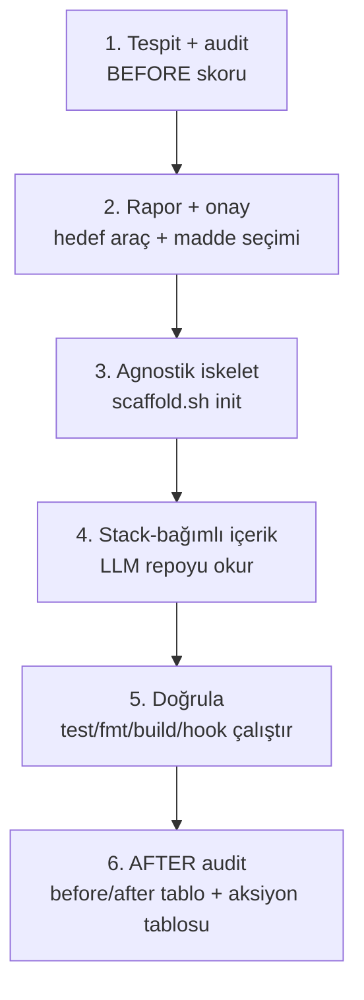

# Mimari — Genel Bakış

vibe-setup, bir repoyu AI/agent destekli geliştirmeye hazırlar. Tasarım iki kata ayrılır;
detay [CLAUDE.md](../../CLAUDE.md) ve [SKILL.md](../../skills/vibe-setup/SKILL.md)'de.

## İki kat

- **Deterministik motor** — [scaffold.sh](../../skills/vibe-setup/scaffold.sh): saf bash, tek
  opsiyonel dep `jq`. Stack tespiti, agnostik iskelet, komut substitüsyonu, sürümlü drift tespiti. Komutlar:
  `audit` (hazırlık tablosu + `SCORE=N/M`), `init` (eksik iskelet, **ezmez**), `init-cursor`
  (Cursor kuralları), `upgrade` (sürüm taşıma; UPDATE/ADD/CONFLICT), `profile` (9 alan + `VIBE_VERSION`).
- **Akıllı kat (LLM)** — SKILL.md akışı: repoyu **okuyup** CLAUDE.md prose, gerçek geçen test,
  `deny` yollarını üretir; upgrade'de CONFLICT'leri merge eder. Stack-bağımlı, koddan çıkarılır — uydurulmaz.

Çekirdek dil-bağımsız; dile özgü tek katman [stack-profiles.md](../../skills/vibe-setup/stack-profiles.md)
(hangi fmt/lint/test/build komutu). Script kanonik, tablo insan-okur ayna — ikisi senkron tutulur.

## Stack tespiti + MODULE_DIR

Manifest dosyasına göre tespit (`go.mod`→go, `package.json`→node, `pyproject.toml`→python, …;
hiçbiri yoksa `unknown`). Manifest kökte olmayabilir — script depth-3'e kadar arar (`MODULE_DIR`).
Proje artefaktları (CLAUDE.md, docs/, hook) **kökte**; stack komutları/testler **MODULE_DIR**'de çalışır.

## Akış (skill, 6 faz)

- **Önce onay**, sonra üret — kullanıcı seçmeden dosya üretilmez; tehlikeli/dışa-dönük maddeler (plugin
  enable, harici repo, izin genişletme) ayrıca onay ister.
- **Doğrulanmadan tamam yok** — her artefakt çalıştırılarak doğrulanır.
- **Idempotent** — script var olanı ezmez (SKIP); tekrar çalıştırmak güvenli.

## Git hook davranışı (herkes için — insan + AI)

- **pre-commit:** fmt, file-capable stack'te (go/node/python/ruby/php/shell) **sadece staged** dosyalar →
  blocking; java/rust/dotnet'te repo-geneli → advisory (asıl kapı CI). lint advisory. doc-sync advisory
  (`STRICT_DOCS=1` → blocking). Tool kurulu değilse atlar.
- **commit-msg:** konu satırı `ABC-1234` ticket-key formatını zorlar (3 BÜYÜK harf + '-' + ≤4 hane);
  merge/revert/fixup/squash muaf; bypass `git commit --no-verify`.

## Sürümleme + upgrade

Engine sürümlüdür (`VIBE_VERSION`, tamsayı). `init`:
- managed dosyalara `vibe-setup:vN` stamp gömer (settings.json hariç — JSON, stamp'siz);
- repo köküne `.vibe-setup.json` yazar: her managed dosya için `{ v, sha }` (sha = üretim anındaki CRC).

`upgrade` (zaten kurulu repo, yeni sürüm) — her managed dosya için **deterministik** sınıflandırır:

| Durum | Koşul | Aksiyon |
|---|---|---|
| **UPDATE** | template değişti **ve** dosya dokunulmamış (sha == manifest) | otomatik regen + restamp + manifest |
| **ADD** | dosya yok | `init` düşürür |
| **CONFLICT** | dosya elle düzenlenmiş (sha ≠ manifest) | engine **ezmez** → LLM 3-yönlü merge (onaylı) |
| OK | content == güncel template | dokunma |

- **synced** (engine sürdürür): AGENTS.md, ADR template, pre-commit, commit-msg.
- **seed** (bir kez düşer, sonra kullanıcının; drift normal → upgrade dokunmaz): settings.json, .gitmessage, docs/README.md, PR/MR.
- **legacy** (manifest yok): provenance kanıtlanamaz → farklı synced dosyalar güvenli CONFLICT.
- **migration**: dosya-dışı dönüşümler için sıralı/idempotent `run_migrations` (dosya-template'leri UPDATE taşır).

Asimetri çözülür: deterministik engine drift'i sha ile yakalar + **asla körlemesine ezmez**; semantik merge LLM'de.
Akış: [SKILL.md](../../skills/vibe-setup/SKILL.md) `## Upgrade akışı`.

## Test

`bash tests/run.sh` — dış dep yok; `tests/*_test.sh` otomatik bulunur. Kapsam: stack tespiti
([profile_test](../../tests/profile_test.sh)), commit-msg ticket-key zorlaması, init idempotency,
audit→init→audit skor döngüsü, **upgrade drift** (UPDATE/ADD/CONFLICT + clobber-koruması).

## Sözlük

Projeye özgü terimler: [domain/glossary.md](../domain/glossary.md).
