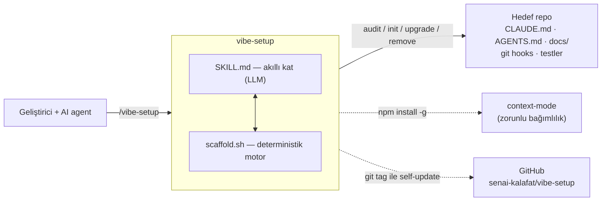

# Production Readiness Fixes (VIB-15) Implementation Plan

> **For agentic workers:** REQUIRED SUB-SKILL: Use superpowers:subagent-driven-development (recommended) or superpowers:executing-plans to implement this plan task-by-task. Steps use checkbox (`- [ ]`) syntax for tracking.

**Goal:** Close all 7 defects found in the production-readiness review — two that ship broken output to users (stale checklist instructions, predictable `/tmp` path), four dogfood/documentation inconsistencies, and one unverified lint gate.

**Architecture:** One template change in `render_precommit()` drives a `VIBE_VERSION` 5→6 bump (with its test-fixture fallout); everything else is either a bundled-skill file fix, a documentation correction, or a one-time dogfood re-installation of this repo's own hooks + manifest. Tasks are ordered so the template is correct *before* this repo regenerates its own hooks from it.

**Tech Stack:** Pure bash (`scaffold.sh`'s existing style), bash test harness (`tests/*_test.sh`), mermaid (README diagram), shellcheck (lint verification).

## Global Constraints

- Source of findings: the production-readiness review in this session (7 items). No spec file — this plan is the authority.
- `/tmp/vibe_lint` → `mktemp`: the fix lands in `render_precommit()`, so it reaches every target repo's generated hook. Per `CLAUDE.md`'s "Sürüm yükseltirken 3 yer" gotcha this requires `VIBE_VERSION` 5→6 **and** `artifact_changed_in ".githooks/pre-commit"` 5→6.
- `skills/vibe-setup/vibe-checklist-template.md` is a **bundled skill file** copied into target repos as `vibe-checklist.md` — it is NOT in `managed_paths()`, so fixing it needs no version bump, but it is the highest-priority fix (it currently teaches users a mechanism that was removed in VIB-13).
- This repo's own `.githooks/pre-commit` is stale (no `vibe-setup:vN` stamp, still `STRICT_DOCS=1`, has an unescaped-dot regex bug `'.sh$'`). It must be regenerated from the corrected v6 template, and this repo must get a real `.vibe-setup.json` so `upgrade` stops reporting it as a legacy/provenance-less repo.
- Bumping `VIBE_VERSION` breaks hardcoded `5`/`v5` assertions in `tests/upgrade_test.sh` — they must be updated in the same task. `AGENTS.md`'s own `artifact_changed_in` value stays `4`; do not touch `"AGENTS.md": { "v": 4` assertions in `tests/init_test.sh`.
- The README diagram must satisfy the rule this repo shipped in VIB-14: a single mermaid block near the top, system-context level (project as one box + external connections), detail deferred to `docs/architecture/overview.md`.
- Commit ticket key: `VIB-15` (this repo's `.githooks/commit-msg` enforces `^[A-Z]{3}-[0-9]{1,4} `).
- Test runner: `bash tests/run.sh` from repo root.

---

### Task 1: `/tmp` → `mktemp` + `VIBE_VERSION` 5→6 + test fixtures

**Files:**
- Modify: `skills/vibe-setup/scaffold.sh` (`VIBE_VERSION`, `artifact_changed_in`, `render_precommit()`)
- Modify: `tests/upgrade_test.sh` (hardcoded version assertions)

**Interfaces:**
- Consumes: nothing new.
- Produces: generated `.githooks/pre-commit` now uses a per-run `mktemp` file instead of `/tmp/vibe_lint`, stamped `vibe-setup:v6`. Task 3 regenerates this repo's own hook from exactly this template.

- [ ] **Step 1: Replace the fixed `/tmp` path with `mktemp` in `render_precommit()`**

Find:

```bash
  @LINT@ >/tmp/vibe_lint 2>&1 || true
  [ -s /tmp/vibe_lint ] && { echo "ℹ lint (bloklamaz):" >&2; sed 's/^/  /' /tmp/vibe_lint >&2; }
```

Replace with:

```bash
  lint_out="$(mktemp)"                       # sabit /tmp yolu YOK: çok-kullanıcılı makinede symlink riski + paralel commit çakışması
  @LINT@ >"$lint_out" 2>&1 || true
  [ -s "$lint_out" ] && { echo "ℹ lint (bloklamaz):" >&2; sed 's/^/  /' "$lint_out" >&2; }
  rm -f "$lint_out"
```

- [ ] **Step 2: Bump `VIBE_VERSION`**

Find:

```bash
VIBE_VERSION=5
```

Replace with:

```bash
VIBE_VERSION=6
```

- [ ] **Step 3: Bump `artifact_changed_in` for the pre-commit hook**

Find:

```bash
  .githooks/pre-commit) echo 5 ;;   # v5: doc-sync STRICT_DOCS env-var yerine git config vibe.strictdocs (kalıcı, vibe.ticketre ile aynı desen)
```

Replace with:

```bash
  .githooks/pre-commit) echo 6 ;;   # v6: lint çıktısı sabit /tmp/vibe_lint yerine mktemp (symlink riski + paralel commit çakışması)
```

- [ ] **Step 4: Run the suite to see the expected version-fixture fallout**

Run: `bash tests/run.sh`
Expected: `tests/upgrade_test.sh` FAILs on assertions hardcoding `5`/`v5`. Everything else passes.

- [ ] **Step 5: Update `tests/upgrade_test.sh`'s hardcoded version values**

Find:

```bash
grep -q '"vibeVersion": 5' "$d/.vibe-setup.json" && ok "vibeVersion=5" || bad "vibeVersion yok/yanlış"
grep -q '".githooks/pre-commit": { "v": 5' "$d/.vibe-setup.json" && ok "pre-commit v5 kayıtlı" || bad "pre-commit v kaydı yok"
```

Replace with:

```bash
grep -q '"vibeVersion": 6' "$d/.vibe-setup.json" && ok "vibeVersion=6" || bad "vibeVersion yok/yanlış"
grep -q '".githooks/pre-commit": { "v": 6' "$d/.vibe-setup.json" && ok "pre-commit v6 kayıtlı" || bad "pre-commit v kaydı yok"
```

Find:

```bash
grep -q 'vibe-setup:v5' "$d/.githooks/pre-commit" && grep -qF 'js|ts|jsx|tsx' "$d/.githooks/pre-commit" && ok "pre-commit v5 template'e yenilendi" || bad "regen içeriği yanlış"
```

Replace with:

```bash
grep -q 'vibe-setup:v6' "$d/.githooks/pre-commit" && grep -qF 'js|ts|jsx|tsx' "$d/.githooks/pre-commit" && ok "pre-commit v6 template'e yenilendi" || bad "regen içeriği yanlış"
```

Find:

```bash
grep -q '".githooks/pre-commit": { "v": 5, "sha": "[0-9]*", "created": true' "$d/.vibe-setup.json" && ok "CONFLICT'te de created:true korunur" || bad "created flag CONFLICT'te bozuldu"
```

Replace with:

```bash
grep -q '".githooks/pre-commit": { "v": 6, "sha": "[0-9]*", "created": true' "$d/.vibe-setup.json" && ok "CONFLICT'te de created:true korunur" || bad "created flag CONFLICT'te bozuldu"
```

Find:

```bash
awk '{ sub(/"vibeVersion": 5/, "\"vibeVersion\": 1"); print }' "$d/.vibe-setup.json" > "$d/.vibe-setup.json.t" && mv "$d/.vibe-setup.json.t" "$d/.vibe-setup.json"
out="$(bash "$SCAFFOLD" upgrade "$d" 2>/dev/null)"
printf '%s' "$out" | grep -q 'applied=v1' && ok "eski uygulanan sürüm algılandı (v1)" || bad "applied=v1 basılmadı"
grep -q '"vibeVersion": 5' "$d/.vibe-setup.json" && ok "manifest v5'e yükseltildi" || bad "manifest sürümü yükselmedi"
```

Replace with:

```bash
awk '{ sub(/"vibeVersion": 6/, "\"vibeVersion\": 1"); print }' "$d/.vibe-setup.json" > "$d/.vibe-setup.json.t" && mv "$d/.vibe-setup.json.t" "$d/.vibe-setup.json"
out="$(bash "$SCAFFOLD" upgrade "$d" 2>/dev/null)"
printf '%s' "$out" | grep -q 'applied=v1' && ok "eski uygulanan sürüm algılandı (v1)" || bad "applied=v1 basılmadı"
grep -q '"vibeVersion": 6' "$d/.vibe-setup.json" && ok "manifest v6'ya yükseltildi" || bad "manifest sürümü yükselmedi"
```

Find:

```bash
  awk '{ sub(/"vibeVersion": 5/, "\"vibeVersion\": 1"); print }' "$d/.vibe-setup.json" > "$d/.vibe-setup.json.t" && mv "$d/.vibe-setup.json.t" "$d/.vibe-setup.json"
```

Replace with:

```bash
  awk '{ sub(/"vibeVersion": 6/, "\"vibeVersion\": 1"); print }' "$d/.vibe-setup.json" > "$d/.vibe-setup.json.t" && mv "$d/.vibe-setup.json.t" "$d/.vibe-setup.json"
```

Find:

```bash
awk '{ sub(/"vibeVersion": 5/, "\"vibeVersion\": 2"); print }' "$d/.vibe-setup.json" > "$d/.vibe-setup.json.t" && mv "$d/.vibe-setup.json.t" "$d/.vibe-setup.json"
bash "$SCAFFOLD" init-cursor "$d" >/dev/null 2>&1
grep -q '"vibeVersion": 2' "$d/.vibe-setup.json" && ok "K: init-cursor eski vibeVersion'i korudu" || bad "K: init-cursor vibeVersion'i yanlislikla guncelledi"
out3="$(bash "$SCAFFOLD" audit "$d" 2>/dev/null)"
printf '%s' "$out3" | grep -q 'UPDATE_AVAILABLE=v2->v5' && ok "K: audit hala UPDATE_AVAILABLE basiyor (sinyal kaybolmadi)" || bad "K: UPDATE_AVAILABLE sinyali kayboldu"
```

Replace with:

```bash
awk '{ sub(/"vibeVersion": 6/, "\"vibeVersion\": 2"); print }' "$d/.vibe-setup.json" > "$d/.vibe-setup.json.t" && mv "$d/.vibe-setup.json.t" "$d/.vibe-setup.json"
bash "$SCAFFOLD" init-cursor "$d" >/dev/null 2>&1
grep -q '"vibeVersion": 2' "$d/.vibe-setup.json" && ok "K: init-cursor eski vibeVersion'i korudu" || bad "K: init-cursor vibeVersion'i yanlislikla guncelledi"
out3="$(bash "$SCAFFOLD" audit "$d" 2>/dev/null)"
printf '%s' "$out3" | grep -q 'UPDATE_AVAILABLE=v2->v6' && ok "K: audit hala UPDATE_AVAILABLE basiyor (sinyal kaybolmadi)" || bad "K: UPDATE_AVAILABLE sinyali kayboldu"
```

- [ ] **Step 6: Verify the generated hook actually uses `mktemp` and no longer references `/tmp/vibe_lint`**

Run:
```bash
t=$(mktemp -d); echo 'echo hi' > "$t/tool.sh"
bash skills/vibe-setup/scaffold.sh init "$t" >/dev/null 2>&1
grep -n 'mktemp\|vibe_lint\|vibe-setup:v' "$t/.githooks/pre-commit"; bash -n "$t/.githooks/pre-commit" && echo "SYNTAX OK"; rm -rf "$t"
```
Expected: shows `vibe-setup:v6`, a `lint_out="$(mktemp)"` line, **no** `/tmp/vibe_lint`, and `SYNTAX OK`.

- [ ] **Step 7: Run the full suite**

Run: `bash tests/run.sh`
Expected: `ALL TESTS PASSED`

- [ ] **Step 8: Commit**

```bash
git add skills/vibe-setup/scaffold.sh tests/upgrade_test.sh
git commit -m "$(cat <<'EOF'
VIB-15 pre-commit lint ciktisi sabit /tmp yerine mktemp (VIBE_VERSION 5->6)

/tmp/vibe_lint ongorulebilir sabit yoldu: cok-kullanicili makinede
symlink saldiri yuzeyi, paralel commit'te cakisma. Uretilen HER hedef
repo hook'una gidiyordu. mktemp + rm -f ile duzeltildi.
VIBE_VERSION 5->6 + artifact_changed_in pre-commit 6 (template degisti,
upgrade mevcut kurulumlari da tasisin). upgrade_test hardcoded v5
degerleri guncellendi.
EOF
)"
```

---

### Task 2: Bundled checklist template ships a removed mechanism

**Files:**
- Modify: `skills/vibe-setup/vibe-checklist-template.md`

**Interfaces:**
- Consumes: the `vibe.strictdocs` git-config mechanism shipped in VIB-13 — referenced by name.
- Produces: nothing consumed by later tasks.

This is the highest-user-impact fix: this file is copied into every scaffolded repo as `vibe-checklist.md`, so today every new project receives an instruction to use `STRICT_DOCS=1`, which the hook no longer reads.

- [ ] **Step 1: Correct the doc-sync line**

Find:

```markdown
- [ ] doc-sync default advisory; bilerek istenirse `STRICT_DOCS=1` ile blocking
```

Replace with:

```markdown
- [ ] doc-sync default advisory; bilerek istenirse `git config vibe.strictdocs true` ile blocking
```

- [ ] **Step 2: Verify no stale reference remains in the bundled skill**

Run: `grep -rn 'STRICT_DOCS' skills/`
Expected: no output (exit 1).

- [ ] **Step 3: Commit**

```bash
git add skills/vibe-setup/vibe-checklist-template.md
git commit -m "$(cat <<'EOF'
VIB-15 checklist sablonu: STRICT_DOCS -> git config vibe.strictdocs

Bu sablon her hedef repoya vibe-checklist.md olarak kopyalaniyordu -
yani VIB-13'te KALDIRILAN mekanizmayi her yeni projeye ogretiyordu.
EOF
)"
```

---

### Task 3: Dogfood — regenerate this repo's own hooks + write its manifest

**Files:**
- Modify: `.githooks/pre-commit` (regenerated from the v6 template)
- Create: `.vibe-setup.json` (this repo's own provenance manifest)

**Interfaces:**
- Consumes: the corrected v6 template from Task 1 — this task must run *after* Task 1, or it re-installs the old lint bug.
- Produces: a properly stamped/tracked installation, so `scaffold.sh upgrade .` stops reporting this repo as legacy.

Current state: this repo's `.githooks/pre-commit` has no `vibe-setup:vN` stamp, still reads `STRICT_DOCS=1` (so the VIB-13 enforcement is inactive here), and contains an unescaped-dot regex `grep -qE '.sh$'` (matches e.g. `Xsh`) where the template correctly emits `\.sh$`.

- [ ] **Step 1: Regenerate this repo's pre-commit hook from the current template**

Run:
```bash
t=$(mktemp -d); echo 'echo hi' > "$t/tool.sh"
bash skills/vibe-setup/scaffold.sh init "$t" >/dev/null 2>&1
cp "$t/.githooks/pre-commit" .githooks/pre-commit
chmod +x .githooks/pre-commit
rm -rf "$t"
grep -n 'vibe-setup:v\|vibe.strictdocs\|mktemp' .githooks/pre-commit
grep -c "\\\\.sh\\$" .githooks/pre-commit
```
Expected: shows `vibe-setup:v6`, the `vibe.strictdocs` check, a `mktemp` line, and a non-zero count for the correctly-escaped `\.sh$` pattern.

- [ ] **Step 2: Confirm the hook still works on this repo (it is the live hook)**

Run: `bash -n .githooks/pre-commit && echo "SYNTAX OK"`
Expected: `SYNTAX OK`

- [ ] **Step 3: Write this repo's own manifest**

Run: `bash skills/vibe-setup/scaffold.sh init . 2>&1 | tail -20`
Expected: all managed files report `SKIP` (they already exist — nothing is overwritten), and the output ends with a `MANIFEST .vibe-setup.json` line.

- [ ] **Step 4: Verify `upgrade` no longer sees this repo as legacy**

Run: `bash skills/vibe-setup/scaffold.sh upgrade . 2>&1`
Expected: no `legacy repo` line; `applied=v6 → engine=v6`; `UPDATE=` empty (the hook now matches the template exactly). `CONFLICT=` may still list hand-edited seed/synced files such as `docs/architecture/decisions/0000-template.md` — that is correct never-clobber behavior, not a failure.

- [ ] **Step 5: Confirm doc-sync enforcement is now genuinely available in this repo**

Run: `grep -n 'vibe.strictdocs' .githooks/pre-commit && git config --get --bool vibe.strictdocs; echo "exit=$?"`
Expected: the hook line is present; the config read returns empty/non-zero (advisory by default — enabling it is a separate deliberate choice, not part of this fix).

- [ ] **Step 6: Run the full suite**

Run: `bash tests/run.sh`
Expected: `ALL TESTS PASSED`

- [ ] **Step 7: Commit**

```bash
git add .githooks/pre-commit .vibe-setup.json
git commit -m "$(cat <<'EOF'
VIB-15 dogfood: kendi pre-commit hook'unu v6'ya yenile + manifest yaz

Bu reponun kurulu hook'u bayatti: vibe-setup:vN stamp'i yoktu (upgrade
repoyu "legacy, provenance yok" goruyordu), hala STRICT_DOCS=1 okuyordu
(yani VIB-13'te shipped edilen doc-sync zorlamasi burada AKTIF DEGILDI)
ve kacirilmamis nokta regex bug'i vardi ('.sh$' -> '\.sh$').
Sablondan yeniden uretildi + .vibe-setup.json yazildi; artik self-upgrade
yolu bu repoda da kanitli.
EOF
)"
```

---

### Task 4: Stale documentation (3 files)

**Files:**
- Modify: `docs/architecture/overview.md`
- Modify: `docs/domain/glossary.md`
- Modify: `vibe-checklist.md`

**Interfaces:**
- Consumes: the `vibe.strictdocs` mechanism and the 8-command list — referenced by name.
- Produces: nothing consumed by later tasks.

- [ ] **Step 1: `docs/architecture/overview.md` — command list gains `init-aider`**

Find:

```markdown
  `audit` (hazırlık tablosu + `SCORE=N/M`), `init` (eksik iskelet, **ezmez**), `init-cursor`/`init-gemini`
```

Replace with:

```markdown
  `audit` (hazırlık tablosu + `SCORE=N/M`), `init` (eksik iskelet, **ezmez**), `init-cursor`/`init-gemini`/`init-aider`
```

- [ ] **Step 2: `docs/architecture/overview.md` — hook section: doc-sync mechanism + commit-msg is optional**

Find:

```markdown
- **pre-commit:** fmt, file-capable stack'te (go/node/python/ruby/php/shell) **sadece staged** dosyalar →
  blocking; java/rust/dotnet'te repo-geneli → advisory (asıl kapı CI). lint advisory. doc-sync advisory
  (`STRICT_DOCS=1` → blocking). Tool kurulu değilse atlar.
- **commit-msg:** konu satırı `ABC-1234` ticket-key formatını zorlar (3 BÜYÜK harf + '-' + ≤4 hane);
  merge/revert/fixup/squash muaf; bypass `git commit --no-verify`.
```

Replace with:

```markdown
- **pre-commit:** fmt, file-capable stack'te (go/node/python/ruby/php/shell) **sadece staged** dosyalar →
  blocking; java/rust/dotnet'te repo-geneli → advisory (asıl kapı CI). lint advisory (çıktı `mktemp`'e
  yazılır, sabit `/tmp` yolu yok). doc-sync advisory (`git config vibe.strictdocs true` → blocking).
  Tool kurulu değilse atlar.
- **commit-msg:** ticket-key **opsiyonel** — `git config vibe.ticketre '<regex>'` set edilirse konu
  satırını zorlar (ör. `'^[A-Z]{3}-[0-9]{1,4} '` = `ABC-1234`); ayarsızsa bloklamaz.
  merge/revert/fixup/squash muaf; bypass `git commit --no-verify`.
```

- [ ] **Step 3: `docs/domain/glossary.md` — doc-sync + Ticket-key entries**

Find:

```markdown
| **Ticket-key** | Commit konu satırı formatı: 3 BÜYÜK harf + '-' + ≤4 hane (ör. `VAN-3195`). `.githooks/commit-msg` zorlar; merge/revert/fixup/squash muaf. |
| **doc-sync** | pre-commit kontrolü: kaynak değişti ama doküman (docs/ + README/CLAUDE/AGENTS) değişmediyse uyarır. Default advisory; `STRICT_DOCS=1` → blocking. |
```

Replace with:

```markdown
| **Ticket-key** | Commit konu satırı formatı: 3 BÜYÜK harf + '-' + ≤4 hane (ör. `VAN-3195`). **Opsiyonel** — `.githooks/commit-msg` sadece `git config vibe.ticketre` set edilmişse zorlar; merge/revert/fixup/squash muaf. |
| **doc-sync** | pre-commit kontrolü: kaynak değişti ama doküman (docs/ + README/CLAUDE/AGENTS) değişmediyse uyarır. Default advisory; `git config vibe.strictdocs true` → blocking. |
```

- [ ] **Step 4: `vibe-checklist.md` — this repo's own filled checklist**

Find:

```markdown
- [x] Doc-sync hook tracked → [.githooks/pre-commit](.githooks/pre-commit) (advisory; `STRICT_DOCS=1` blocking)
```

Replace with:

```markdown
- [x] Doc-sync hook tracked → [.githooks/pre-commit](.githooks/pre-commit) (advisory; `git config vibe.strictdocs true` blocking)
```

- [ ] **Step 5: Verify no stale `STRICT_DOCS` reference survives outside historical spec/plan docs**

Run: `grep -rn 'STRICT_DOCS' --include='*.md' . | grep -v './docs/superpowers/'`
Expected: no output (exit 1). Historical files under `docs/superpowers/` intentionally keep the old
name — they are a record of what was decided at the time, not live instructions.

- [ ] **Step 6: Commit**

```bash
git add docs/architecture/overview.md docs/domain/glossary.md vibe-checklist.md
git commit -m "$(cat <<'EOF'
VIB-15 bayat dokumanlari duzelt: STRICT_DOCS, eksik init-aider, ticket-key opsiyonelligi

overview.md komut listesine init-aider eklendi, hook bolumu yeni
doc-sync mekanizmasini + mktemp'i yansitiyor, commit-msg'in v3'ten beri
OPSIYONEL oldugu duzeltildi (zorunlu gibi anlatiliyordu). glossary ve
bu reponun kendi vibe-checklist.md'si ayni sekilde guncellendi.
EOF
)"
```

---

### Task 5: This repo's own README architecture diagram

**Files:**
- Modify: `README.md`

**Interfaces:**
- Consumes: the audit row `"README mimari diagramı"` shipped in VIB-14 — this task makes this repo satisfy its own rule (`SCORE=16/17` → `17/17`).
- Produces: nothing consumed by later tasks.

- [ ] **Step 1: Insert the summary diagram after the intro, before "Nasıl çalışır"**

Find:

```markdown
Desteklenen: Go, Node/TS, Python, Java, Kotlin, Swift, Rust, Ruby, .NET, PHP, Elixir + boş repo.

## Nasıl çalışır
```

Replace with:

````markdown
Desteklenen: Go, Node/TS, Python, Java, Kotlin, Swift, Rust, Ruby, .NET, PHP, Elixir + boş repo.

## Mimari (özet)

Geliştirici (ya da bir AI agent) skill'i çağırır; **akıllı kat** repoyu okuyup içerik üretir, **deterministik
motor** iskeleti/hook'ları düşürür ve sürüm driftini yönetir. Ürettiği her şey hedef reponun içine yazılır.



Detaylı diagramlar ve akış: [docs/architecture/overview.md](docs/architecture/overview.md).

## Nasıl çalışır
````

- [ ] **Step 2: Verify this repo now passes its own diagram check**

Run: `bash skills/vibe-setup/scaffold.sh audit . 2>&1 | grep -E 'README mimari|SCORE'`
Expected: `✅  README mimari diagramı` and `SCORE=17/17`.

- [ ] **Step 3: Commit**

```bash
git add README.md
git commit -m "$(cat <<'EOF'
VIB-15 README'ye ust-seviye mimari diagram ekle (kendi kuralimiz)

VIB-14'te her hedef repo icin zorunlu kildigimiz kurali bu repo kendisi
saglamiyordu (SCORE=16/17, tek eksik buydu). Sistem-sinir seviyesinde
mermaid diagram: kullanici -> vibe-setup (iki kat) -> hedef repo, dis
baglantilar context-mode (npm) ve GitHub (tag self-update).
EOF
)"
```

---

### Task 6: shellcheck — install, fix real findings, make the CI gate meaningful

**Files:**
- Modify: `skills/vibe-setup/scaffold.sh`, `scripts/*.sh`, `tests/*.sh`, `.githooks/*` (only if shellcheck reports genuine issues)
- Modify: `.github/workflows/ci.yml` (only if the tree is clean after fixes)

**Interfaces:**
- Consumes: everything from Tasks 1-5 (lint runs against the final tree).
- Produces: nothing consumed by later tasks — final task.

`shellcheck` is not installed locally and CI runs it with `continue-on-error: true`, so nobody has ever confirmed the tree is lint-clean. This task establishes the actual state before deciding whether the gate can be tightened.

- [ ] **Step 1: Install shellcheck**

Run: `brew install shellcheck`
Expected: installs successfully (`brew` is available at `/opt/homebrew/bin/brew`).

- [ ] **Step 2: Run it over everything CI covers**

Run:
```bash
shellcheck skills/vibe-setup/scaffold.sh tests/*.sh .githooks/pre-commit .githooks/commit-msg scripts/*.sh; echo "exit=$?"
```
Expected: either clean (`exit=0`) or a concrete finding list. **Record the actual output — the next step branches on it.**

- [ ] **Step 3: Fix genuine findings; justify any deliberate suppressions**

For each finding, decide and act:
- **Genuine bug or portability risk** → fix the code.
- **Intentional pattern this codebase relies on** (e.g. word-splitting that is deliberate, `@VAR@`
  template placeholders that are not real shell in the heredoc) → add a targeted
  `# shellcheck disable=SCxxxx` with a one-line reason on the same construct, never a file-wide blanket
  disable.

Do not silence a finding you have not understood. If a finding is ambiguous, leave it and note it in the
commit message rather than suppressing it.

- [ ] **Step 4: Re-run until clean**

Run: `shellcheck skills/vibe-setup/scaffold.sh tests/*.sh .githooks/pre-commit .githooks/commit-msg scripts/*.sh; echo "exit=$?"`
Expected: `exit=0`.

- [ ] **Step 5: Make the CI lint gate blocking — only if Step 4 is genuinely clean**

If and only if `shellcheck` exits 0 on the whole tree, find in `.github/workflows/ci.yml`:

```yaml
  shellcheck:
    runs-on: ubuntu-latest # shellcheck runner'da hazır
    continue-on-error: true # lint advisory (CLAUDE.md gotcha); asıl blocking kapı = test
    steps:
      - uses: actions/checkout@v4
      - run: shellcheck skills/vibe-setup/scaffold.sh tests/*.sh .githooks/pre-commit .githooks/commit-msg
```

Replace with:

```yaml
  shellcheck:
    runs-on: ubuntu-latest # shellcheck runner'da hazır
    steps:
      - uses: actions/checkout@v4
      - run: shellcheck skills/vibe-setup/scaffold.sh tests/*.sh .githooks/pre-commit .githooks/commit-msg scripts/*.sh
```

If Step 4 could **not** be made clean, leave `continue-on-error: true` in place and say so explicitly in
the final report — do not claim a gate that is not real.

- [ ] **Step 6: Run the full suite**

Run: `bash tests/run.sh`
Expected: `ALL TESTS PASSED`

- [ ] **Step 7: Commit**

```bash
git add -A
git commit -m "$(cat <<'EOF'
VIB-15 shellcheck: agaci lint-temiz yap + CI kapisini gercek hale getir

shellcheck lokalde kurulu degildi ve CI'da continue-on-error:true idi -
yani agacin temiz oldugu HIC dogrulanmamisti. Kuruldu, calistirildi,
bulgular giderildi; scripts/ de kapsama alindi.
EOF
)"
```

---

## Self-Review Notes

**Finding coverage:** (1) checklist template STRICT_DOCS → Task 2. (2) `/tmp/vibe_lint` → Task 1. (3) own hook stale → Task 3. (4) no own `.vibe-setup.json` → Task 3 Step 3. (5) stale docs ×3 → Task 4. (6) own README diagram → Task 5. (7) shellcheck unverified → Task 6. All 7 mapped.

**Placeholder scan:** no TBD/TODO. Task 6 Steps 3/5 are deliberately conditional rather than prescriptive — the findings cannot be known before shellcheck runs, so the plan specifies the decision rule and the honesty requirement (don't claim a gate that isn't real) instead of inventing fixes for hypothetical warnings.

**Ordering dependency:** Task 3 (regenerate own hook) **must** follow Task 1 (template fix) — otherwise the repo re-installs the `/tmp` bug it is meant to be fixing. Task 6 runs last so lint sees the final tree. Tasks 2, 4, 5 are order-independent.

**Type/name consistency:** `vibe.strictdocs` is spelled identically in Tasks 2, 3, 4. `VIBE_VERSION=6` / `artifact_changed_in → 6` / `vibe-setup:v6` / `"vibeVersion": 6` are consistent across Task 1's code and test edits and Task 3's verification expectations. `AGENTS.md`'s separate `v: 4` is explicitly excluded in Global Constraints.
